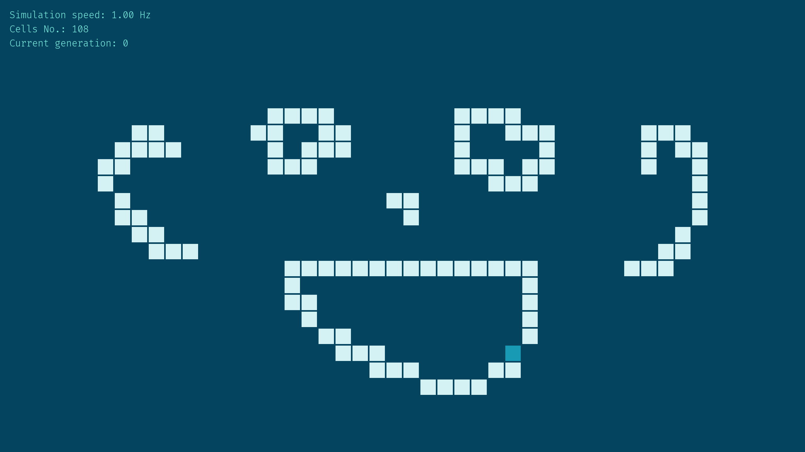
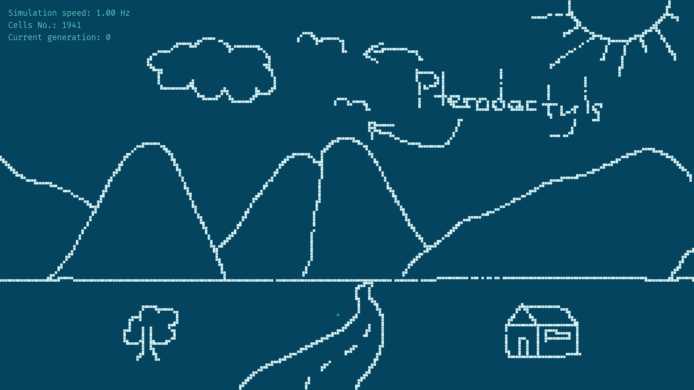

# Game of Life in Python (Golipy)

Golipy is a simulator of John H. Conway's Game of Life, developed in
Python based on the [Pygame](https://www.pygame.org/) library.

This is a toy project developed as an illustrative example of this
simulator for the [Conf.IT](https://confit.es) talk [I attended as a
lecturer](https://confit.es/ponencias/computacion-involutiva/) in
November 2021.

## Features

To run it, it is enough to have a Python >=3.7 environment with Pygame
installed. Then, executing the main.py file will launch the simulation.

|  | 
|:--:| 
| *Golipy universe with some cells activated* |

From now on, the simulation is managed on the basis of the following
inputs:

- **Enter** and **Space**: Start the simulation. If it's already running, both
  keys will pause and resume the simulation
- **Delete**: Resets the simulation
- **W**, **A**, **S** and **D**: To move around the canvas
- **+** and **-**: Accelerates and slows down the simulation
- Mouse **left** and **right** click: Activates/deactivates the cell
  where the mouse pointer is currently standing
- Mouse wheel **up** and **down**: Zooms in and out the canvas.

|  |  |
|:--:|:--:| 
| *Zooming out the canvas* | *Zooming in the canvas* |

## License

This software is licensed under the terms of the GNU General Public
License Version 3+.

The [FiraCode](https://github.com/tonsky/FiraCode) font is licensed
under the SIL Open Font License 1.1.